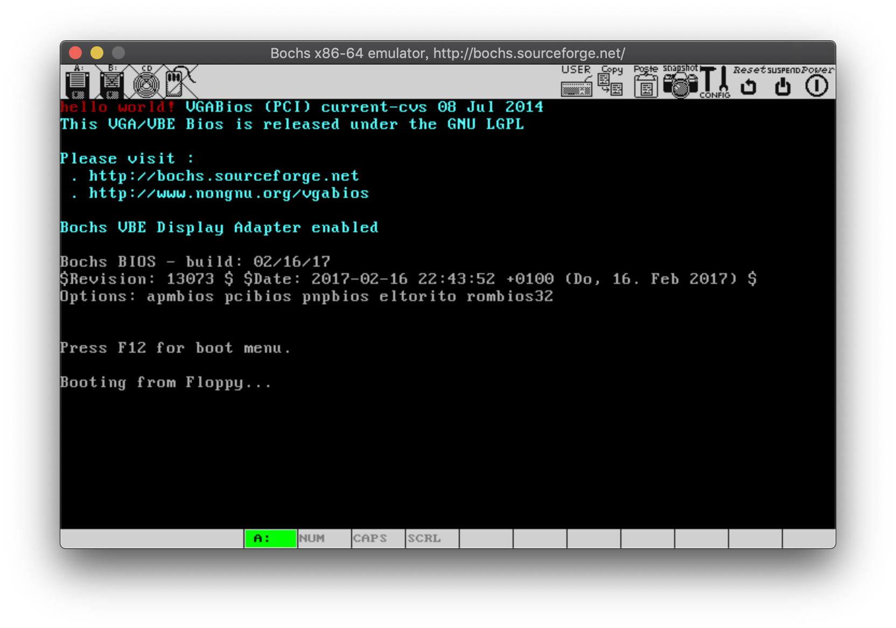

# x86从实模式到保护模式(1)——hello wolrd

2019.12.25


>   要点：使用nasm编写x86 16位汇编代码，在bochs模拟器中输出hello wolrd。


## 1. 基本概念

内存分配：

-   CPU寻找范围：1MB，0x00000~0xFFFFF
-   RAM：低端640KB，0x00000~0x9FFFF
-   ROM-BIOS：最高端64KB，0xF0000~0xFFFFF

磁盘：

-   磁头(header)、磁道(track)或柱面(cylinder)、扇区(sector)
-   类比圆柱坐标系：
    -   磁头 类似于 高度$z$
    -   磁道/柱面 类似于 半径$\rho$
    -   扇区 类似于 角度$\phi$


-   定位扇区位置：（磁道号，磁头号，扇区号）
-   两种模式：
    -   CHS：需要注意磁道、磁头、扇区号不能越界，不好用！！！
    -   LBA：逻辑块地址(Logical Block Address)。不考虑物理分布，统一按逻辑扇区编号
        -   $LBA = C \times 磁头总数 \times 每磁道扇区数 + H \times 每磁道扇区数 + (S-1)$
-   有效引导扇区：以0x55和0xAA结尾


计算器启动流程：

(1) 系统上电复位（CS=0xFFFF, other=0x0000），从BIOS内存区的0xFFFF0开始执行。

(2) ROM-BIOS执行诊断、检测、初始化

(3) ROM-BIOS加载主引导扇区（硬盘上的0面0道1扇区 Main Boot Sector，共512字节）

(4) 从0x0000:0x7C00开始执行mbr代码


显卡：

-   图形模式
-   文本模式：80x25，共2000个字符
    -   显存映射：0xB8000~0xBFFFF，共32KB
    -   屏幕上每个字符对应显存中的两个连续字符
        -   前者（单字中的低8位）：ASCII值
        -   后者（单字中的高8位）：显示属性。低四位为前景色，高四位为背景色。0x04为黑底红字；0x07为黑底白字。


bochs:

-   `.bochsrc`配置文件：`man bochs`和`man 5 bochsrc` 

-   使用bochs调试：
    -   对物理地址打断点：`pb 0x7c00`
    -   显示断点信息：`info break`
    -   执行程序：单步`n`；继续`c`。
    -   打开寄存器信息：`trace-reg on`

## 2. nasm代码

c05_mbr.asm

```nasm
;
; c05_mbr
;
; 16-bit asm program to print hello world.
;
; Init reg: cs=0xffff, other=0x0000
; Memery size: 1MB
; Memory map:
;
;  +                  RAM                  +                  ROM-BIOS
;  |                                       |                   |   |
;  +---+---+---+---+---+---+---+---+---+---+---+---+---+---+---+---+
;  |   |   |   |   |   |   |   |   |   |   |   |   |   |   |   |   |
;  +---+---+---+---+---+---+---+---+---+---+---+---+---+---+---+---+
;  |   |   |   |   |   |   |   |   |   |   |   |   |   |   |   |   |
;  0   1   2   3   4   5   6   7   8   9   a   b   c   d   e   f  end
;

BOOTSEG equ 0x07c0
VRAMSEG	equ 0xb800
COLOR	equ 0x04

; Program starts here.
start:
	mov ax, BOOTSEG
	mov ds, ax
	mov ax, VRAMSEG
	mov es, ax

; Write string to the vga memory
	mov si, ascii
	xor di, di
pchar:
	mov al, [ds:si]
	mov ah, COLOR
	mov word [es:di], ax
	inc si
	inc di
	inc di
	cmp si, ascii+len
	jnz pchar

infi:
	jmp near infi

; Message stores here.
ascii	db 'hello world!'
len	equ $ - ascii

; Reserves some space
	times 510 - ($ - $$) db 0x00

; Set main boot sector signature.
mbr_sig:
	db 0x55, 0xaa
```

.bochsrc（bochsrc）

```
# 内存
megs: 4

# BIOS
romimage: file=$BXSHARE/BIOS-bochs-latest

# VGA BIOS
vgaromimage: file=$BXSHARE/VGABIOS-lgpl-latest

# 磁盘
floppya: 1_44=c05_mbr.img, status=inserted

# 硬盘
ata0: enabled=1,ioaddr1=0x1f0

boot: floppy

#log: bochsout.txt
log: /dev/null

mouse: enabled=0
```


Makefile

```makefile
# Makefile for learn-asm

OBJS = c05_mbr.bin

AS = nasm
ASFLAGS = -f bin -l $*.lst

all : $(OBJS)

# 汇编
%.bin : %.asm
	$(AS) $(ASFLAGS) $< -o $@

# 生成bochs所需的软盘镜像文件，并设置.bochsrc配置文件
bochs_% : %.bin
	dd bs=512 count=1 if=$< of=$*.img
	sed -i -n "s/1_44=.*,/1_44=$*.img,/" .bochsrc

.PHONY : clean
clean :
	-rm -rf *.bin *.lst *.img bochsout.txt
```


## 3 编译执行

```bash
$ bochs
========================================================================
                       Bochs x86 Emulator 2.6.9
               Built from SVN snapshot on April 9, 2017
                  Compiled on Dec 23 2018 at 17:15:13
========================================================================

......略......
Please choose one: [6] 
00000000000i[      ] lt_dlhandle is 0x7fe22c8306c0
00000000000i[PLUGIN] loaded plugin libbx_sdl2.so
00000000000i[      ] installing sdl2 module as the Bochs GUI
00000000000i[SDL2  ] maximum host resolution: x=2880 y=1800
00000000000i[      ] using log file /dev/null
Next at t=0
(0) [0x0000fffffff0] f000:fff0 (unk. ctxt): jmpf 0xf000:e05b          ; ea5be000f0
<bochs:1> pb 0x7c00 		# 断点1
<bochs:2> pb 0x7c20 		# 断点2
<bochs:5> trace-reg on 	# 开启寄存器跟踪
Register-Tracing enabled for CPU0
<bochs:6> info break 		#显示断点信息
Num Type           Disp Enb Address
  1 pbreakpoint    keep y   0x000000007c00
  2 pbreakpoint    keep y   0x000000007c20
<bochs:7> c 						# 执行到0x7c00处暂停
(0) Breakpoint 1, 0x0000000000007c00 in ?? ()
Next at t=14040245
CPU0:
rax: 00000000_0000aa55 rcx: 00000000_00090000
rdx: 00000000_00000000 rbx: 00000000_00000000
rsp: 00000000_0000ffd6 rbp: 00000000_00000000
rsi: 00000000_000e0000 rdi: 00000000_0000ffac
r8 : 00000000_00000000 r9 : 00000000_00000000
r10: 00000000_00000000 r11: 00000000_00000000
r12: 00000000_00000000 r13: 00000000_00000000
r14: 00000000_00000000 r15: 00000000_00000000
rip: 00000000_00007c00
eflags 0x00000082: id vip vif ac vm rf nt IOPL=0 of df if tf SF zf af pf cf
(0) [0x000000007c00] 0000:7c00 (unk. ctxt): mov ax, 0x07c0            ; b8c007
<bochs:8> c 						# 执行到死循环处暂停，查看屏幕输出
(0) Breakpoint 2, 0x0000000000007c20 in ?? ()
Next at t=14040347
CPU0:
rax: 00000000_00000421 rcx: 00000000_00090000
rdx: 00000000_00000000 rbx: 00000000_00000000
rsp: 00000000_0000ffd6 rbp: 00000000_00000000
rsi: 00000000_000e002f rdi: 00000000_00000018
r8 : 00000000_00000000 r9 : 00000000_00000000
r10: 00000000_00000000 r11: 00000000_00000000
r12: 00000000_00000000 r13: 00000000_00000000
r14: 00000000_00000000 r15: 00000000_00000000
rip: 00000000_00007c20
eflags 0x00000046: id vip vif ac vm rf nt IOPL=0 of df if tf sf ZF af PF cf
(0) [0x000000007c20] 0000:7c20 (unk. ctxt): jmp .-3 (0x00007c20)      ; e9fdff
<bochs:9> q 						# 退出bochs
```



说明：截图左上角显示红色`hello world!`，执行成功。

